# TraceCanvas

<p align="center">
  <picture>
    <source media="(prefers-color-scheme: dark)" srcset="docs/assets/banner.png" />
    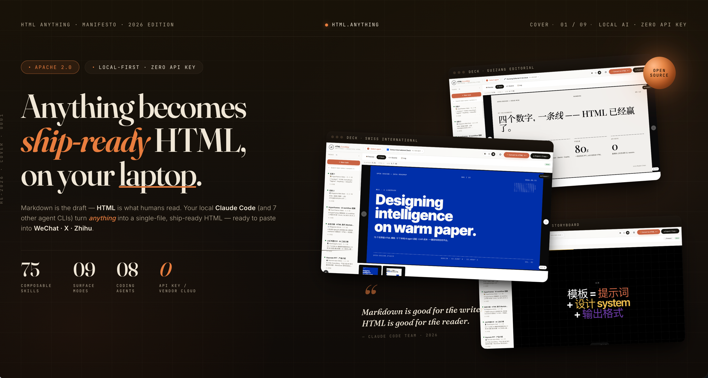
  </picture>
</p>

<p align="center">
  <a href="https://github.com/kenny2077/TraceCanvas/actions/workflows/ci.yml"></a>
  <a href="https://github.com/kenny2077/TraceCanvas/blob/main/LICENSE"></a>
  <a href="#supported-agents"></a>
  <a href="#skill-templates"></a>
  <a href="#12-export-targets"></a>
  <a href="#quick-start"></a>
  <a href="#security"></a>
</p>

<p align="center">
  
  
  
  
  
</p>

<p align="center">
  <b>Your local coding agent, with a design system.</b><br/>
  Paste content. Choose a template. Watch your agent stream world-class HTML —<br/>
  then export to WeChat, Zhihu, Notion, PNG, PPTX, PDF, and more. No API keys.
</p>

---

## 💡 Why TraceCanvas

Claude Code's team [stopped writing Markdown](https://x.com/trq212/status/2052809885763747935). They write everything in HTML now — because HTML is what readers actually see. Markdown is an authoring convenience; HTML is the finished product.

The problem: writing good HTML by hand means writing CSS, tuning typography, aligning to a grid, and making it responsive. Most people won't. Most AI tools spit out generic, purple-gradient slop that looks like every other AI output.

TraceCanvas bridges the gap. It gives your local coding agent a **design system** — 80 skill templates with hard typographic constraints, real font stacks, and platform-aware export — so the output looks hand-crafted by a designer, not generated by a model. And because it runs through the CLI you already pay for, there's **zero marginal cost**.

| Without TraceCanvas | With TraceCanvas |
|---|---|
| Agent outputs Markdown → you reformat it | Agent outputs finished HTML → you ship it |
| "Make it look good" is a vibe | 8px baseline grid, color contrast ≥ 4.5, CJK-first font stack |
| Export means copy-paste-edit-repeat | One click → WeChat / Zhihu / Notion / PNG / PPTX / PDF |
| Every generation starts from zero | 80 design templates, each with `example.html` the agent replicates |
| Nobody knows where the numbers came from | Every data point annotated with a traceable source key |

---

## 📸 What It Looks Like

<p align="center">
  
  
</p>

<p align="center">
  
  
</p>

<p align="center">
  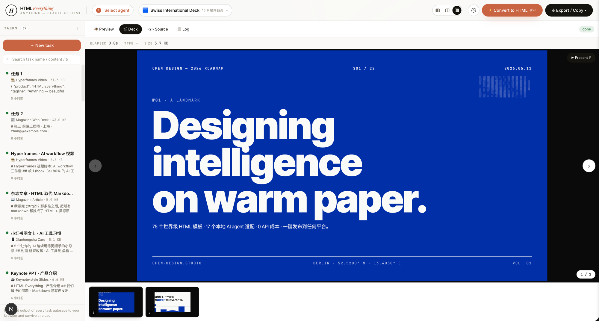
  
</p>

<p align="center">
  <sub><b>Featured skills</b> — each ships with a hand-authored <code>example.html</code></sub>
</p>

<p align="center">
  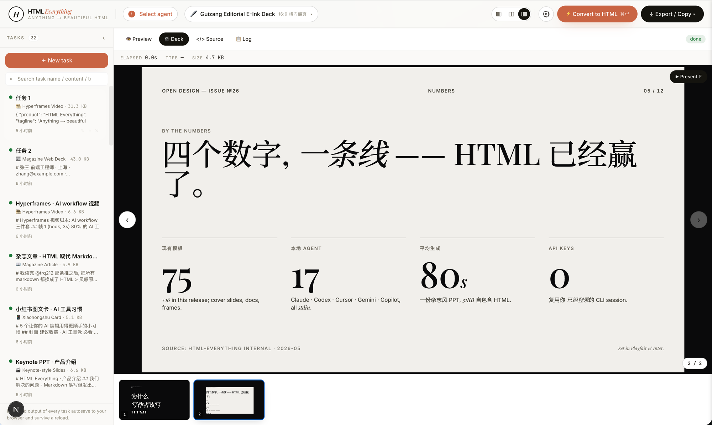
  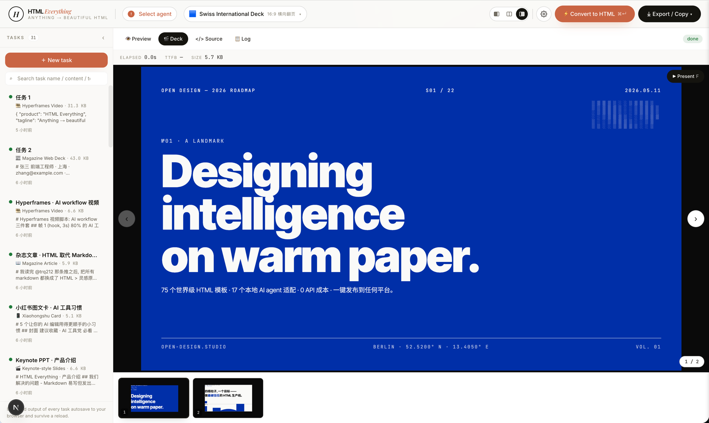
  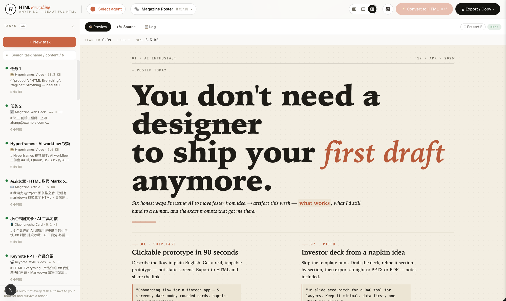
  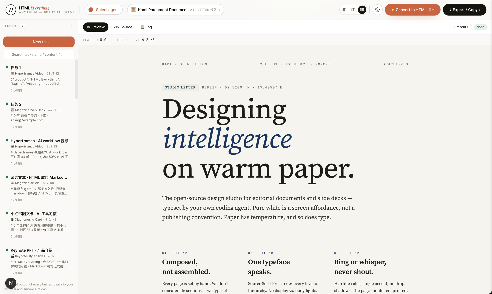
</p>

<p align="center">
  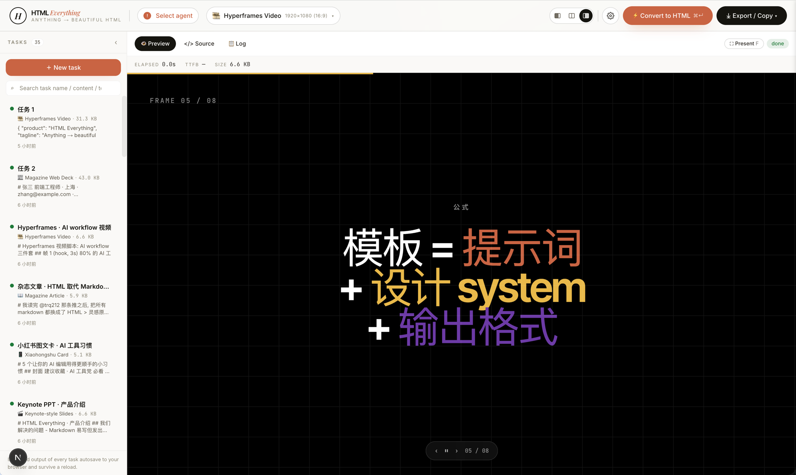
  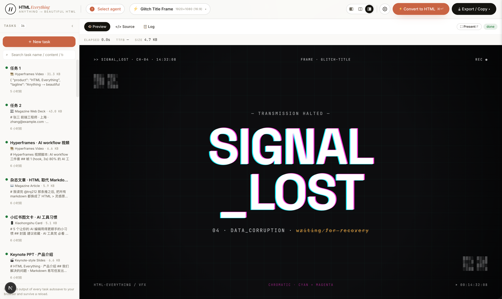
  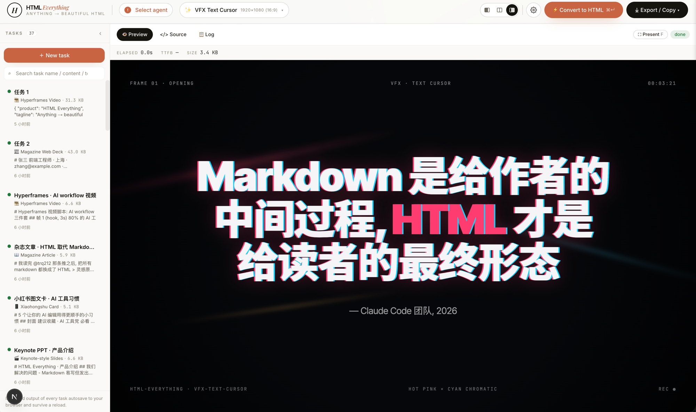
  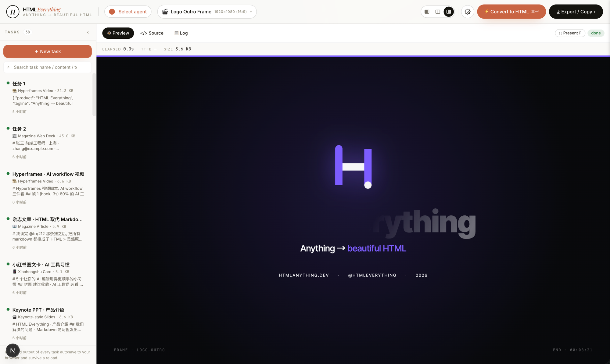
</p>

<!-- TODO: add a 15-20s GIF (docs/assets/demo.gif) showing the full flow: paste data → pick template → streaming generation → export -->
<!-- TODO: add dark-mode banner variant at docs/assets/banner-dark.png -->

---

## 🔄 How It Works

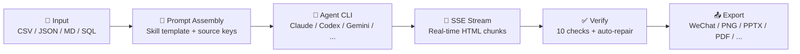

1. **Parse** — Auto-detect format (CSV, JSON, Markdown, SQL, YAML, plain text), convert to structured data with A1 cell IDs.
2. **Assemble** — Combine a skill template's design constraints + source-key rules + your data into a single prompt.
3. **Generate** — Your local agent CLI streams HTML back via SSE. You watch it write in real time.
4. **Verify** — 10 automated checks: HTML well-formedness, script/event handler safety, DOMPurify diff, source-key coverage, content fidelity.
5. **Repair** — Conservative auto-fix for broken tags, unclosed elements, and attribute fragments. Never invents content.
6. **Export** — One click to any of 12 targets, or deploy directly to Vercel.

---

## ✨ Features

### 🤖 Agent-Native

TraceCanvas isn't another AI wrapper. It doesn't call an API. It spawns the coding-agent CLI already installed on your machine — Claude Code, Codex, Gemini CLI, Cursor Agent, and 13 others. If you've run `claude login`, it just works. Your subscription, your session, your rate limits. Zero additional cost.

### 🎨 80 Design Templates

Every template is a folder with a `SKILL.md` file — not a JSON config or a code plugin. Each one ships with a hand-authored `example.html` that the agent uses as a target to replicate. Templates span 8 modes:

| Mode | Count | Examples |
|------|-------|----------|
| `deck` | 20 | Swiss International, Guizang Editorial, Replit Style, XHS Pastel |
| `prototype` | 12 | SaaS landing, dashboard, editorial web, brutalist, wireframe |
| `frame` | 10 | Liquid background hero, NYT data chart, glitch title, cinematic light leak |
| `social` | 8 | X post card, Spotify card, Reddit card, social carousel |
| `office` | 15 | PM spec, runbook, finance report, invoice, OKRs, kanban, meeting notes |
| `doc` | 2 | Kami parchment editorial, docs page |
| `vfx` | 3 | Text cursor animation, sprite animation, motion frames |
| `mockup` | 1 | 3D device mockup |

Adding a template = dropping a folder. No code changes, no registration step. See [CONTRIBUTING.md](CONTRIBUTING.md) for the skill authoring guide.

### 🔍 Source-Grounding

Every data point in the output is annotated with a traceable source key:

```html
<td>Engineering</td><!-- pf-src: rows[].department -->
<td class="text-right">4.2</td><!-- pf-src: rows[].score -->
```

The verification engine checks that all expected source keys are present, no invalid keys reference non-existent fields, sampled data values appear verbatim, and no forbidden `data-pf-source-id` attributes exist. This is the feature that separates TraceCanvas from generic AI HTML generators — the output is auditable.

### 📤 12 Export Targets

| Target | Method |
|--------|--------|
| **WeChat** | `juice` inline CSS → `ClipboardItem` paste |
| **Zhihu** | Math formula conversion (`<mjx-container>` → `data-eeimg`) |
| **Bilibili** | Platform-compatible formatting |
| **Notion** | Clean HTML import |
| **Bluesky** | Formatted post |
| **Mastodon** | Formatted post |
| **PNG** | `modern-screenshot` 2× DPI render |
| **PPTX** | `pptxgenjs` slide generation |
| **PDF** | Browser print-to-PDF |
| **HTML** | Self-contained `.html` download |
| **Remotion** | Video project ZIP export |
| **Markdown** | Roundtrip conversion |

### 🛡️ Security

TraceCanvas is local-first by design:

- **No server database.** No authentication. No multi-tenancy. Everything runs on your machine.
- **Host-header gate.** Middleware rejects non-loopback `Host` headers to prevent DNS rebinding attacks on the agent-spawn endpoint. Configurable via `HTML_ANYTHING_ALLOWED_HOSTS`.
- **Secrets never logged.** `sanitizeErrorBody()` strips `sk-` prefixes and `Bearer` tokens from error messages.
- **HTML sandbox.** All previews render in `iframe[sandbox="allow-scripts allow-same-origin"]`. Script tags, event handlers, and `javascript:` URLs in generated output are rejected by DOMPurify.
- **Deploy tokens.** Stored at `~/.html-anything/vercel.json` with `chmod 600`.

### 🧪 Prompt Lab

A developer harness at `/dev/prompt-lab` for testing agent compliance across adapters. Edit prompts inline, run against fixtures, and view raw HTML, source keys, verification reports, and scores side-by-side. Runs are saved to localStorage history.

---

## 🚀 Quick Start

### Prerequisites

- **Node.js** ≥ 20
- **pnpm** ≥ 9
- **At least one coding-agent CLI** installed and authenticated:
  - [Claude Code](https://docs.anthropic.com/en/docs/claude-code) — `npm i -g @anthropic-ai/claude-code && claude login`
  - [OpenAI Codex CLI](https://github.com/openai/codex) — `npm i -g @openai/codex`
  - [Gemini CLI](https://github.com/google-gemini/gemini-cli) — `npm i -g @google-gemini/gemini-cli && gemini auth`
  - [Cursor Agent](https://cursor.com) — built into Cursor IDE
  - Or any of the [17 supported agents](#supported-agents)

### Install & Run

```bash
# Clone
git clone https://github.com/kenny2077/TraceCanvas.git
cd TraceCanvas/html-anything-main

# Install dependencies
pnpm install --frozen-lockfile

# Start the dev server
pnpm -F @html-anything/next dev
```

Open `http://localhost:3000`. The welcome modal scans for installed agents. Pick one, paste content, choose a template from the picker, and click **⚡ Convert**.

### Usage Example

```bash
# 1. Start the dev server
pnpm -F @html-anything/next dev

# 2. Open http://localhost:3000
# 3. Paste this CSV into the editor:
```

```
department,score,headcount
Engineering,4.2,32
Design,4.7,12
Marketing,3.8,18
Product,4.5,8
```

```
# 4. Pick "Data Brief" from the template picker
# 5. Click Convert (or ⌘+Enter)
# 6. Watch Claude Code stream an HTML dashboard with charts and KPI cards
# 7. Export → WeChat → paste directly into the WeChat editor
```

> **Pro tip:** Use ⌘+Enter (Ctrl+Enter on Windows/Linux) to trigger conversion from the keyboard.

---

## ⚙️ Configuration

TraceCanvas reads these environment variables at runtime:

| Variable | Default | Description |
|----------|---------|-------------|
| `HTML_ANYTHING_ALLOWED_HOSTS` | (empty) | Comma-separated list of additional `Host` header values to allow. Use when proxying behind a reverse proxy on your LAN. |
| `HTML_ANYTHING_ALLOW_ANY_HOST` | `0` | Set to `1` to disable the host-header security gate entirely. Only do this if a trusted reverse proxy terminates `Host` upstream. |
| `DEEPSEEK_API_KEY` | (unset) | API key for the DeepSeek API agent adapter. |
| `KIMI_API_KEY` | (unset) | API key for the Kimi API agent adapter. |

Set them in `html-anything-main/next/.env.local`:

```bash
# Allow access from your LAN reverse proxy
HTML_ANYTHING_ALLOWED_HOSTS=my-lan-hostname.local
```

---

## 🤖 Supported Agents

TraceCanvas detects coding-agent CLIs by scanning `PATH` (including directories GUI launchers often drop: `~/.local/bin`, `~/.bun/bin`, `/opt/homebrew/bin`, `~/.npm-global/bin`).

### Fully Wired (stdin protocol)

| Agent | CLI Binary | Streaming | First Run |
|-------|-----------|-----------|-----------|
| **Claude Code** | `claude` | ✅ stream-json | `npm i -g @anthropic-ai/claude-code` |
| **OpenAI Codex** | `codex` | ✅ json | `npm i -g @openai/codex` |
| **Cursor Agent** | `cursor-agent` | ✅ stream-json | Built into Cursor IDE |
| **Gemini CLI** | `gemini` | ✅ stream-json | `npm i -g @google-gemini/gemini-cli` |
| **GitHub Copilot** | `copilot` | ✅ json | `npm i -g @github/copilot-cli` |
| **OpenCode** | `opencode` | ✅ json | `npm i -g opencode` |
| **Qwen Coder** | `qwen` | ✅ plain | `npm i -g @alibaba/qwen-coder` |
| **Qoder CLI** | `qodercli` | ✅ stream-json | `npm i -g qodercli` |
| **Aider** | `aider` | — batch | `pip install aider` |
| **DeepSeek TUI** | `deepseek` | ✅ plain | `npm i -g deepseek` |
| **OpenClaw** | `openclaw` | ❌ batch | Multi-agent gateway |

### API-Based

| Agent | Streaming | Setup |
|-------|-----------|-------|
| **DeepSeek API** | ✅ | Set `DEEPSEEK_API_KEY` |
| **Kimi API** | ✅ | Set `KIMI_API_KEY` |

### Detection-Only (ACP / pi-rpc — not yet wired)

Hermes, Kimi CLI, Devin, Kiro, Kilo, Vibe, and Pi are detected and shown in the picker but return a friendly "protocol not yet supported" message if selected. ACP JSON-RPC and pi-rpc adapters are on the [roadmap](#roadmap).

### Built-In

| Agent | Description |
|-------|-------------|
| **Mock** | Always available. Returns a deterministic HTML fixture for testing and demos. No CLI or API key needed. |

---

## 🎨 Skill Templates

80 templates in [`next/src/lib/templates/skills/`](next/src/lib/templates/skills/). Each is a folder with a `SKILL.md` (YAML frontmatter + prompt body) and a hand-authored `example.html`. Templates are organized along two axes in the picker:

- **Mode** — what the output *is*: `prototype`, `deck`, `frame`, `social`, `office`, `doc`, `mockup`, `vfx`
- **Scenario** — who it's *for*: `design`, `marketing`, `engineering`, `product`, `finance`, `hr`, `sale`, `personal`

Every `SKILL.md` enforces hard design constraints that prevent generic AI-slop output: 8px baseline grid, CJK-first font stacks, minimum 4.5:1 color contrast, real `:focus` states on interactive elements, and an absolute ban on lorem ipsum and purple gradients.

**Adding a template = adding a folder.** Drop it into `skills/`, restart the dev server, and it appears in the picker. See [CONTRIBUTING.md](CONTRIBUTING.md) for the full skill authoring guide.

---

## ⌨️ Commands

```bash
# Development
pnpm -F @html-anything/next dev          # Start dev server (localhost:3000)

# Quality
pnpm -F @html-anything/next typecheck    # TypeScript check
pnpm -F @html-anything/next test         # Unit tests (Vitest)
pnpm -F @html-anything/e2e typecheck     # E2E TypeScript check
pnpm -F @html-anything/e2e test          # E2E tests (Playwright)

# Production
pnpm -F @html-anything/next build        # Production build
pnpm -F @html-anything/next start        # Start production server

# Guard (run before pushing)
pnpm exec tsx scripts/guard.ts           # Validate project shape
```

---

## 📁 Project Structure

```
TraceCanvas/
├── docs/                              # Architecture + release docs
│   ├── architecture.md
│   ├── trust-pipeline.md
│   ├── verification-model.md
│   ├── agent-adapters.md
│   └── release-gate.md
├── html-anything-main/                # ← The application
│   ├── next/
│   │   └── src/
│   │       ├── app/
│   │       │   ├── page.tsx           # Main editor shell
│   │       │   ├── dev/prompt-lab/    # Prompt testing harness
│   │       │   └── api/               # 9 REST routes
│   │       ├── components/            # 20 React components
│   │       ├── lib/
│   │       │   ├── agents/            # 17 agent adapters + prompt composer
│   │       │   ├── parsers/           # CSV/TSV/JSON format detection
│   │       │   ├── templates/         # 80 skill templates + loader
│   │       │   ├── sources/           # A1-cell CSV parser + postprocessor
│   │       │   ├── verify/            # 10-check verification engine
│   │       │   ├── repair/            # Conservative HTML auto-repair
│   │       │   ├── export/            # 12 export targets
│   │       │   ├── deploy/            # Vercel one-click deploy
│   │       │   ├── history/           # IndexedDB version history
│   │       │   ├── security/          # Host-header DNS rebinding defense
│   │       │   └── store.ts           # Zustand state (localStorage persisted)
│   │       └── middleware.ts          # API route security gate
│   ├── e2e/                           # Playwright E2E tests (3 specs)
│   ├── docs/
│   │   ├── assets/banner.png          # README banner
│   │   └── screenshots/               # UI screenshots + skill thumbnails
│   └── scripts/                       # Benchmark runners + fixtures
└── references/                        # Upstream research projects
```

### API Routes

| Route | Method | Description |
|-------|--------|-------------|
| `/api/agents` | `GET` | Detect installed agent CLIs |
| `/api/convert` | `POST` | Generate HTML via agent (SSE stream) |
| `/api/draft` | `POST` | AI-assisted markdown drafting |
| `/api/templates` | `GET` | List skill templates |
| `/api/deploy` | `POST` | Deploy HTML to Vercel preview |
| `/api/deploy/config` | `GET PUT DELETE` | Manage deploy tokens |
| `/api/marketplace` | `GET` | List installed skill packs |
| `/api/marketplace/install` | `POST` | Install skill pack from GitHub |
| `/api/agent/eval` | `POST` | Prompt evaluation (dev harness) |

All POST routes use validated request schemas. Invalid input returns a descriptive error:

```json
{ "error": "Validation failed", "details": [{ "field": "agent", "message": "agent is required." }] }
```

---

## 🗺️ Roadmap

### v0.5 (next)

- [ ] ACP JSON-RPC protocol support for Hermes, Kimi CLI, Devin, Kiro, Kilo, Vibe
- [ ] pi-rpc protocol support for Pi
- [ ] Skill marketplace: auto-update for installed packs
- [ ] Cloudflare Pages deploy target

### v1.0

- [ ] API route integration tests (mock agent harness)
- [ ] E2E smoke test covering full convert → preview → export flow
- [ ] DOM-parser-based HTML validation post-extraction
- [ ] localStorage migration test suite (v1→v7 store versions)
- [ ] Windows native path testing
- [ ] Deck presenter mode with speaker notes export

### Later

- [ ] Image input support (screenshot → HTML prototype)
- [ ] Collaborative skill editing
- [ ] Agent output diff viewer (compare runs side-by-side)
- [ ] Scheduled regeneration (refresh a dashboard daily)

---

## ⚠️ Limitations

TraceCanvas makes deliberate trade-offs. Here's what it doesn't do and why:

- **No hosted inference.** TraceCanvas spawns your local CLI. If your agent is slow or rate-limited, TraceCanvas is slow or rate-limited. The Mock agent is available for instant demos.
- **Regex-based HTML extraction.** The current `extractHtml()` uses regex to pull HTML from agent output, not a full DOM parser. Malformed agent output can produce a broken preview. A DOM-parser-based extraction is on the v1.0 roadmap.
- **No mobile UI.** The editor is designed for desktop use. Iframe previews, code views, and deck navigation assume a ≥1024px viewport.
- **localStorage persistence.** The Zustand store persists to localStorage with a 5 MB origin-wide cap. Large HTML outputs with many tasks can hit the quota. IndexedDB history (capped at 20 versions/task) was added to mitigate this, but the primary store still uses localStorage.
- **No authentication.** TraceCanvas is single-user, localhost-only. Don't expose it to the public internet. The host-header gate provides defense-in-depth, but the intended deployment model is `localhost:3000` on your laptop.
- **Agent CLI fragility.** Agent adapters hardcode CLI flags (`--output-format stream-json`, `--yolo`, etc.) that can break when the upstream CLI changes its interface. Each adapter is lightweight (~10 lines) so fixes are quick, but you may need to update after a CLI upgrade.

---

## 👥 Contributing

TraceCanvas is designed so the highest-leverage contributions are **files, not framework code** — a skill folder, a prompt fragment, or a ten-line agent adapter. See [CONTRIBUTING.md](CONTRIBUTING.md) for:

- How to add a new skill template (one folder, ~3 files)
- How to hook up a new coding-agent CLI (~10 lines)
- How to add a new export target (one component + one helper)
- PR bars, code style, and commit conventions

Also available in [简体中文](CONTRIBUTING.zh-CN.md).

---

## 🙏 Acknowledgements

TraceCanvas stands on the shoulders of several open-source projects:

- **[nexu-io/open-design](https://github.com/nexu-io/open-design)** — Agent detection architecture, design system methodology, and the Skills protocol that TraceCanvas's template system is built on.
- **[mdnice/markdown-nice](https://github.com/mdnice/markdown-nice)** — Proved the viability of `juice` CSS inlining for WeChat/Zhihu copy-paste compatibility.
- **[gcui-art/markdown-to-image](https://github.com/gcui-art/markdown-to-image)** — Established the iframe → high-DPI PNG export path using `modern-screenshot`.
- **[alchaincyf/huashu-design](https://github.com/alchaincyf/huashu-design)** — Anti-AI-slop design philosophy and the hard-constraint approach to prompt engineering that shapes every TraceCanvas skill template.
- **[op7418/guizang-ppt-skill](https://github.com/op7418/guizang-ppt-skill)** — The `deck-guizang-editorial` skill is vendored from this project (retains original license and attribution).

---

## 📄 License

Apache 2.0 © 2025 TraceCanvas contributors. See [LICENSE](LICENSE) for full text.

Vendored works in `next/src/lib/templates/skills/` retain their original licenses and authorship attribution — check each skill folder's own `LICENSE` or `README.md` for upstream terms.

---

<p align="center">
  <sub>Built with Next.js 16 · React 19 · Zustand 5 · PapaParse 5 · DOMPurify 3 · Tailwind CSS 4 · Vitest 4 · Playwright</sub>
</p>
