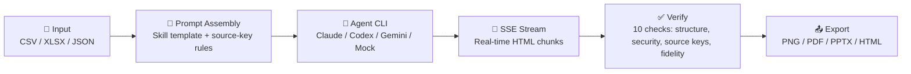

# TraceCanvas

<p align="center">
  <picture>
    <source media="(prefers-color-scheme: dark)" srcset="docs/assets/banner.png" />
    
  </picture>
</p>

<p align="center">
  <a href="https://github.com/kenny2077/TraceCanvas/actions/workflows/ci.yml"></a>
  <a href="https://github.com/kenny2077/TraceCanvas/blob/main/LICENSE"></a>
  <a href="#supported-agents"></a>
  <a href="#skill-templates"></a>
  <a href="#export-targets"></a>
  <a href="#quick-start"></a>
  <a href="#security"></a>
</p>

<p align="center">
  <b>Auditable HTML reports generated by local coding agents from structured data.</b><br/>
  Paste a CSV. Pick a template. Watch your agent stream a verified HTML report —<br/>
  every number traceable, every claim checkable. Export to PNG, PDF, or PPTX.
</p>

---

## 💡 Why TraceCanvas

AI-generated reports look great — until someone asks "where did this number come from?" Most tools can't answer. The output is a black box: prompts, hallucinations, and formatting errors all mixed together.

TraceCanvas is different. It treats **trust as a first-class feature**, not an afterthought:

| Without TraceCanvas | With TraceCanvas |
|---|---|
| Agent outputs Markdown → you reformat it | Agent outputs finished HTML → you ship it |
| "Looks good" is a vibe | 10 automated checks: structure, security, source-key coverage, content fidelity |
| Nobody knows where the numbers came from | Every data point annotated with `<!-- pf-src: rows[].score -->` |
| Export means copy-paste-edit-repeat | One click → PNG / PDF / PPTX / HTML |
| Hallucinated data goes unnoticed | Fidelity sampling catches values that don't match input |

The killer feature is the **verification receipt**: a score (0–100) backed by 10 automated checks that prove the generated report did not invent, drop, or distort your data. This is the wedge that makes TraceCanvas defensible against Canva, Gamma, and generic AI HTML generators — the value is not just "looks good." It is **looks good and every number can be checked.**

---

## 📸 What It Looks Like

<p align="center">
  
  
</p>

<p align="center">
  
  
</p>

<!-- TODO: add a 15-20s GIF (docs/assets/demo.gif) showing the full flow: paste data → pick template → streaming generation → verification receipt → export -->
<!-- TODO: add dark-mode banner variant at docs/assets/banner-dark.png -->

---

## 🔄 How It Works



1. **Parse** — Auto-detect format (CSV, XLSX, JSON, Markdown, plain text). CSV/TSV/JSON are converted to structured documents with A1 cell IDs.
2. **Assemble** — Combine a skill template's design constraints + source-key annotation rules + your data into a single prompt.
3. **Generate** — Your local agent CLI (or the built-in Mock agent) streams HTML back via SSE. You watch it write in real time.
4. **Verify** — 10 automated checks run after generation:
   - HTML structure, security, sanitizer diff
   - Source-key presence, coverage, validity
   - Content fidelity (sampled values match input)
   - Anti-pattern detection (forbidden attributes, markdown fences)
5. **Repair** — Conservative auto-fix for broken tags, unclosed elements. Never invents content.
6. **Export** — One click to PNG, PDF, PPTX, or self-contained HTML.

---

## ✨ Features

### 🔍 Source-Grounding (The Killer Feature)

Every data point in the output is annotated with a traceable source key:

```html
<td>Engineering</td><!-- pf-src: rows[].department -->
<td class="text-right">4.2</td><!-- pf-src: rows[].score -->
```

The verification engine checks:
- **Presence** — Are source-key comments in the HTML?
- **Coverage** — What % of expected keys are found?
- **Validity** — Do all keys reference real fields?
- **Fidelity** — Do sampled input values appear verbatim in the output?
- **Anti-patterns** — No forbidden `data-pf-source-id` attributes, no markdown fences

This is what separates TraceCanvas from generic AI HTML generators — the output is **auditable**.

### 🤖 Agent-Native + Mock Agent

TraceCanvas spawns the coding-agent CLI already installed on your machine — Claude Code, Codex, Gemini CLI, Cursor Agent, and others. If you've run `claude login`, it just works. Zero additional cost.

**Don't have a coding agent installed?** The built-in **Mock Agent** returns deterministic HTML fixtures for instant demos. No CLI, no API key, no setup.

### 🎨 80 Design Templates

Every template is a folder with a `SKILL.md` file — not a JSON config. Templates span 15 categories, with report/data templates optimized for source-grounded output:

| Category | Count | 1.0 Heroes |
|----------|-------|------------|
| `report` | 4 | Data Brief, Survey Insight, Research Note, Executive Summary |
| `data` | 1 | Data Brief |
| `slides` | 22 | Swiss International, Guizang Editorial |
| `doc` | 6 | Kami parchment, Weekly Update |
| `dashboard` | 8 | Live dashboard, Team dashboard |
| `card` | 7 | X post card, Spotify card |
| `poster` | 5 | Magazine poster, Hero poster |
| *(other)* | 27 | Prototype, video, mobile, finance, resume, email, social |

Adding a template = dropping a folder. No code changes. See [CONTRIBUTING.md](CONTRIBUTING.md).

### 📤 Export Targets

| Target | Status | Method |
|--------|--------|--------|
| **PNG** | ✅ Ready | `modern-screenshot` 2× DPI render |
| **PDF** | ✅ Ready | Browser print-to-PDF |
| **PPTX** | ✅ Ready | Deck slides via `pptxgenjs` (slide decks only) |
| **HTML** | ✅ Ready | Self-contained `.html` download |
| **WeChat** | ✅ Ready | `juice` inline CSS → `ClipboardItem` paste |
| **Zhihu** | ✅ Ready | Math formula conversion |
| Bilibili | ⚠️ Stub | Platform-compatible formatting |
| Bluesky | ⚠️ Stub | Formatted post |
| Mastodon | ⚠️ Stub | Formatted post |
| Notion | ⚠️ Stub | Clean HTML import |
| Remotion | ⚠️ Stub | Video project ZIP export |
| Markdown | ⚠️ Stub | Roundtrip conversion |

### 🛡️ Security

- **No server database.** No authentication. Everything runs on your machine.
- **Host-header gate.** Middleware rejects non-loopback `Host` headers.
- **Secrets never logged.** `sanitizeErrorBody()` strips tokens from errors.
- **HTML sandbox.** Previews render in `iframe[sandbox="allow-scripts allow-same-origin"]`. DOMPurify rejects scripts and event handlers.

---

## 🚀 Quick Start

### Prerequisites

- **Node.js** ≥ 20
- **pnpm** ≥ 9
- *(Optional)* A coding-agent CLI for live generation. The **Mock Agent** works without one.

### Install & Run

```bash
# Clone
git clone https://github.com/kenny2077/TraceCanvas.git
cd TraceCanvas/html-anything-main

# Install dependencies
pnpm install --frozen-lockfile

# Start the dev server
pnpm -F @html-anything/next dev
```

Open `http://localhost:3000`. The welcome modal opens automatically.

### Demo Without Any CLI (Mock Agent)

1. Select **"Mock Agent"** in the welcome modal
2. Paste this CSV into the editor:

```csv
department,score,headcount
Engineering,4.2,32
Design,4.7,12
Marketing,3.8,18
Product,4.5,8
```

3. Pick **"Data Brief"** from the template picker
4. Click **⚡ Convert** (or ⌘+Enter)
5. Watch the HTML stream into the preview pane
6. Inspect the **Verification Receipt** below the preview — score, 10 checks, source-key coverage
7. Click **Export → PNG** to download

### With a Real Coding Agent

If you have Claude Code, Codex, or another supported agent installed:

1. Select your agent in the welcome modal
2. Paste data, pick a template, convert
3. The agent streams real HTML with source-key annotations
4. Verification runs the same 10 checks

---

## ⚙️ Configuration

| Variable | Default | Description |
|----------|---------|-------------|
| `HTML_ANYTHING_ALLOWED_HOSTS` | (empty) | Additional `Host` headers to allow |
| `HTML_ANYTHING_ALLOW_ANY_HOST` | `0` | Set to `1` to disable host-header gate |

Set them in `html-anything-main/next/.env.local`.

---

## 🤖 Supported Agents

### Fully Wired (stdin protocol)

| Agent | CLI Binary | Streaming | Setup |
|-------|-----------|-----------|-------|
| **Claude Code** | `claude` | ✅ stream-json | `npm i -g @anthropic-ai/claude-code` |
| **OpenAI Codex** | `codex` | ✅ json | `npm i -g @openai/codex` |
| **Cursor Agent** | `cursor-agent` | ✅ stream-json | Built into Cursor IDE |
| **Gemini CLI** | `gemini` | ✅ stream-json | `npm i -g @google-gemini/gemini-cli` |
| **GitHub Copilot** | `copilot` | ✅ json | `npm i -g @github/copilot-cli` |
| **OpenCode** | `opencode` | ✅ json | `npm i -g opencode` |
| **Qwen Coder** | `qwen` | ✅ plain | `npm i -g @alibaba/qwen-coder` |
| **Qoder CLI** | `qodercli` | ✅ stream-json | `npm i -g qodercli` |
| **Aider** | `aider` | — batch | `pip install aider` |
| **DeepSeek TUI** | `deepseek` | ✅ plain | `npm i -g deepseek` |
| **OpenClaw** | `openclaw` | ❌ batch | Multi-agent gateway |

### Built-In

| Agent | Description |
|-------|-------------|
| **Mock** | Always available. Deterministic HTML fixture for demos. No CLI or API key. |

### Detection-Only (not yet wired)

Hermes, Kimi CLI, Devin, Kiro, Kilo, Vibe, and Pi are detected but show "protocol not yet supported." ACP JSON-RPC and pi-rpc adapters are on the roadmap.

---

## ⌨️ Commands

```bash
# Development
pnpm -F @html-anything/next dev          # Start dev server (localhost:3000)

# Quality
pnpm -F @html-anything/next typecheck    # TypeScript check
pnpm -F @html-anything/next test         # Unit tests (Vitest)
pnpm -F @html-anything/e2e typecheck     # E2E TypeScript check
pnpm -F @html-anything/e2e test          # E2E tests (Playwright)

# Production
pnpm -F @html-anything/next build        # Production build
pnpm -F @html-anything/next start        # Start production server

# Guard (run before pushing)
pnpm exec tsx scripts/guard.ts           # Validate project shape
```

---

## 📁 Project Structure

```
TraceCanvas/
├── docs/                              # Architecture + release docs
│   ├── analysis/mvp-audit.md          # Pre-1.0 audit
│   ├── demo-script.md                 # Killer demo steps
│   ├── architecture.md
│   ├── trust-pipeline.md
│   ├── verification-model.md
│   ├── agent-adapters.md
│   └── release-gate.md
├── html-anything-main/                # ← The application
│   ├── next/
│   │   └── src/
│   │       ├── app/
│   │       │   ├── page.tsx           # Main editor shell
│   │       │   ├── api/               # REST routes (agents, convert, templates, deploy)
│   │       │   └── dev/prompt-lab/    # Prompt testing harness
│   │       ├── components/            # React components
│   │       ├── lib/
│   │       │   ├── agents/            # 11 agent adapters + mock + prompt composer
│   │       │   ├── parsers/           # CSV/TSV/JSON format detection + source-key generation
│   │       │   ├── templates/         # 80 skill templates + loader
│   │       │   ├── sources/           # A1-cell CSV parser + source-key postprocessor
│   │       │   ├── verify/            # 10-check verification engine
│   │       │   ├── repair/            # Conservative HTML auto-repair
│   │       │   ├── export/            # PNG/PDF/PPTX/HTML/WeChat/Zhihu export
│   │       │   ├── deploy/            # Vercel one-click deploy
│   │       │   ├── history/           # IndexedDB version history
│   │       │   ├── security/          # Host-header DNS rebinding defense
│   │       │   └── store.ts           # Zustand state (localStorage persisted)
│   │       └── middleware.ts          # API route security gate
│   ├── e2e/                           # Playwright E2E tests
│   ├── docs/
│   │   ├── assets/banner.png          # README banner
│   │   └── screenshots/               # UI screenshots
│   └── scripts/                       # Benchmark runners + fixtures
└── references/                        # Upstream research projects
```

---

## 🗺️ Roadmap

### v1.0 (Current Focus)

- [x] Mock agent for demo-without-CLI
- [x] Source-key rules injected into prompts
- [x] Full 10-check verification wired into main flow
- [x] Verification receipt as hero UI
- [x] Fidelity sample generation from structured data
- [x] Killer-flow E2E test
- [ ] API route integration tests with mock agent
- [ ] DOM-parser-based HTML validation post-extraction
- [ ] Windows native path testing
- [ ] README screenshots/GIF refresh

### v0.5+ (Post-1.0)

- [ ] ACP JSON-RPC protocol support
- [ ] Skill marketplace auto-update
- [ ] Cloudflare Pages deploy target
- [ ] Deck presenter mode with speaker notes export

### Later

- [ ] Image input support
- [ ] Collaborative skill editing
- [ ] Agent output diff viewer
- [ ] Scheduled regeneration

---

## ⚠️ Limitations

- **No hosted inference.** TraceCanvas spawns your local CLI. The Mock agent is available for instant demos.
- **Regex-based HTML extraction.** The current `extractHtml()` uses regex. A DOM-parser-based extraction is on the v1.0 roadmap.
- **No mobile UI.** Designed for desktop use (≥1024px viewport).
- **localStorage persistence.** The Zustand store persists to localStorage with a 5 MB cap. IndexedDB history mitigates this.
- **No authentication.** Single-user, localhost-only. Don't expose to the public internet.
- **Agent CLI fragility.** Adapters hardcode CLI flags that can break on upstream upgrades. Each adapter is lightweight (~10 lines) so fixes are quick.

---

## 👥 Contributing

The highest-leverage contributions are **files, not framework code** — a skill folder, a prompt fragment, or a ten-line agent adapter. See [CONTRIBUTING.md](CONTRIBUTING.md) for:

- How to add a new skill template (one folder, ~3 files)
- How to hook up a new coding-agent CLI (~10 lines)
- How to add a new export target (one component + one helper)
- PR bars, code style, and commit conventions

Also available in [简体中文](CONTRIBUTING.zh-CN.md).

---

## 🙏 Acknowledgements

- **[nexu-io/open-design](https://github.com/nexu-io/open-design)** — Agent detection architecture and Skills protocol.
- **[mdnice/markdown-nice](https://github.com/mdnice/markdown-nice)** — `juice` CSS inlining for WeChat/Zhihu.
- **[gcui-art/markdown-to-image](https://github.com/gcui-art/markdown-to-image)** — iframe → high-DPI PNG export path.
- **[alchaincyf/huashu-design](https://github.com/alchaincyf/huashu-design)** — Anti-AI-slop design philosophy.
- **[op7418/guizang-ppt-skill](https://github.com/op7418/guizang-ppt-skill)** — `deck-guizang-editorial` skill (retains original license).

---

## 📄 License

Apache 2.0 © 2025 TraceCanvas contributors. See [LICENSE](LICENSE) for full text.

Vendored works in `next/src/lib/templates/skills/` retain their original licenses.

---

<p align="center">
  <sub>Built with Next.js 16 · React 19 · Zustand 5 · PapaParse 5 · DOMPurify 3 · Tailwind CSS 4 · Vitest 4 · Playwright</sub>
</p>
